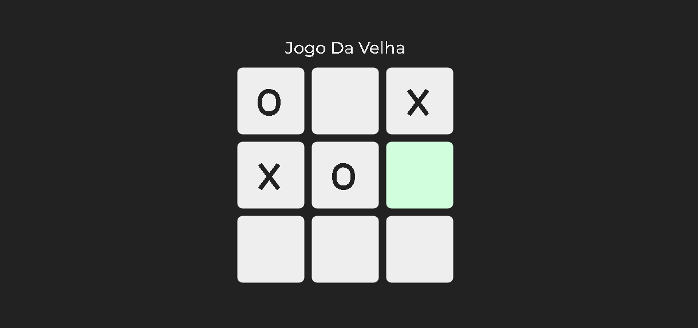

# Jogo da Velha
Projeto de um Jogo da Velha usando funções e mecanicas basicas de JavaScript, animações com o CSS, e conceitos basicos no HTML, um Projeto com foco em JS mas dando a devida importancia ao design 
[Link da Página](https://nathanrigolei.github.io/JogoDaVelha/)

